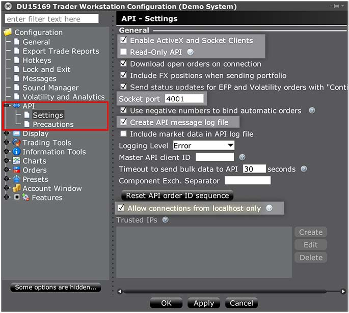
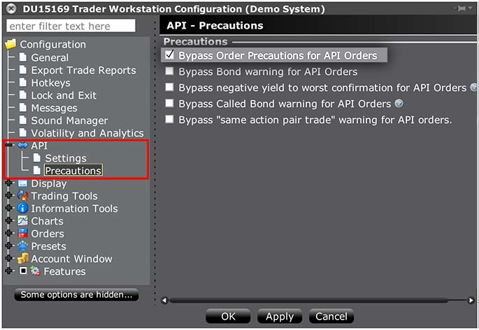

Installation
============

Install QTPyLib using ``pip``
-----------------------------

.. code:: bash

    $ pip install qtpylib --upgrade --no-cache-dir

Uninstall QTPyLib
~~~~~~~~~~~~~~~~~

To uninstall QTPyLib using ``pip``, simply use:

.. code:: bash

    $ pip uninstall qtpylib

Possible Conda/Anaconda Issue
~~~~~~~~~~~~~~~~~~~~~~~~~~~~~

If you're using Python under a Conda/Anaconda enviroment, it is possible you'll run
into the following error message during installation that's caused by a
`documented Anaconda bug <https://github.com/ContinuumIO/anaconda-issues/issues/542>`_:

.. code:: bash

    Installing collected packages: setuptools, cryptography
        Found existing installation: setuptools 27.2.0
    Cannot remove entries from nonexistent file ~/anaconda3/lib/python/site-packages/easy-install.pth

To get ``conda`` to play nice with ``pip``, run this command before installing/upgrading QTPyLib:

.. code:: bash

    $ pip install --ignore-installed --upgrade pip setuptools

Requirements
~~~~~~~~~~~~

* `Python <https://www.python.org>`_ >=3.4
* `Pandas <https://github.com/pydata/pandas>`_ (tested to work with >=0.18.1)
* `Numpy <https://github.com/numpy/numpy>`_ (tested to work with >=1.11.1)
* `PyZMQ <https://github.com/zeromq/pyzmq>`_ (tested to work with >=15.2.1)
* `PyMySQL <https://github.com/PyMySQL/PyMySQL>`_ (tested to work with >=0.7.6)
* `pytz <http://pytz.sourceforge.net>`_ (tested to work with >=2016.6.1)
* `dateutil <https://pypi.python.org/pypi/python-dateutil>`_ (tested to work with >=2.5.1)
* `Nexmo-Python <https://github.com/Nexmo/nexmo-python>`_ for SMS support (tested to work with >=1.2.0)
* `Twilio-Python <https://github.com/twilio/twilio-python>`_ for SMS support (tested to work with >=5.4.0)
* `Flask <http://flask.pocoo.org>`_ for the Dashboard (tested to work with >=0.11)
* `Requests <https://github.com/kennethreitz/requests>`_ (tested to work with >=2.10.0)
* `IbPy2 <https://github.com/blampe/IbPy>`_ (tested to work with >=0.8.0)
* `ezIBpy <https://github.com/ranaroussi/ezibpy>`_ (IbPy wrapper, tested to work with >=1.12.66)
* Latest Interactive Brokers’ `TWS <https://www.interactivebrokers.com/en/index.php?f=15875>`_ or `IB Gateway <https://www.interactivebrokers.com/en/index.php?f=16457>`_ installed and running on the machine
* `MySQL Server <https://www.mysql.com/>`_ installed and running with a database for QTPyLib

-----

Install IB TWS / Gateway
------------------------

In order for QTPyLib to be able to subscribe to market data and submit orders,
you must have the latest version of Interactive Brokers’
`TWS <https://www.interactivebrokers.com/en/index.php?f=15875>`_ or
`IB Gateway <https://www.interactivebrokers.com/en/index.php?f=16457>`_
installed, running and **properly configured** on your machine.

Installation
~~~~~~~~~~~~

Download TWS (offline version) or IB Gateway (requires less resources = recommended)
from Interactive Brokers’ website, and follow the installation instructions.

* `Download TWS (Traders Workstation) <https://www.interactivebrokers.com/en/index.php?f=15875>`_
* `Download IB Gateway <https://www.interactivebrokers.com/en/index.php?f=16457>`_

Configure for API Access
~~~~~~~~~~~~~~~~~~~~~~~~

After you install either TWS or IBGW, login using your account
(or use ``edemo``/``demouser``). The next thing to do is to go to the menu,
choose File, then choose **Global Configuration**.

Next, choose API on the left hand side, then go to **Settings**.

In the settings screen, make sure to set the options highlighted in the screenshot below:

Next, go to **Precautions** on the left side menu, and make sure
***Bypass Order Precautions for API Orders** is checked.

-----

Install MySQL
-------------

QTPyLib stores historical data and trades in a MySQL database,
so you'll need to have MySQL (or one of its off-springs like MariaDB or Percona)
installed and running on your machine.

Installation
~~~~~~~~~~~~

To install MySQL, follow the
`installation instructions <http://dev.mysql.com/doc/refman/5.7/en/installing.html>`_.

On Debian/Ubuntu:

.. code:: bash

    $ sudo apt install mysql-server

On Redhat/Fedora:

.. code:: bash

    $ sudo yum install mysql-server

On macOS (using Homebrew):

.. code:: bash

    $ sudo brew install mysql

For Windows, simply `download the installer <http://dev.mysql.com/downloads/installer/>`_ and run it.

During the installation process, you will be asked to set a root password for MySQL;
generate a password and enter it when prompted in the next step.

Create the Database
~~~~~~~~~~~~~~~~~~~

Once you have MySQL installed, create a database and grant a new/existing user
permissions on the database. This is the user and password you will use to
connect to the database in your code.

By default, and unless specified otherwise, QTPyLib looks for a database named ``qtpy``
and user named ``root``. To create this database and user, run this command:

.. code:: bash

    $ mysql -u root -p -e "create database qtpy;"

If you want ro create a dedicate user for this database (highly recommended), run this command:

.. code:: bash

    $ mysql -u root -p -e "create database qtpy; create user '<user>'@'localhost' identified by '<password>'; grant all privileges on qtpy .* to '<user>'@'localhost';"

\* Replace ``<user>`` with the desired user name and ``<password>`` with the desired password for that user.

-----

Now that your system is setup, it's time to start programming your Algo...
