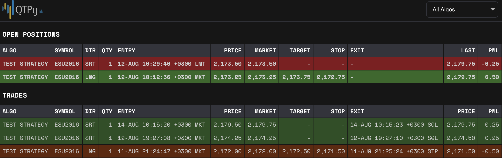

Reporting Web App / API
=======================

QTPyLib comes with a basic reporting web app where you can monitor
your trade history and open positions. While the web app is running,
it also exposes a simple REST API for fetching trades, market data,
etc to create your own application.

.. note::
    Since QTPyLib relies on Interactive Brokers for pretty much
    everything, it's recommended that you create a second user
    for your IB account and use it to log in to TWS on your
    computer or Phone. There you can see the trades made by
    your algorithms, use the built-in charts, etc.

Creating a Web App
------------------

To get a reporting dashboard up and running, you'll need to create
a ``Reports`` object sub-class and name it.

.. code:: python

    # dashboard.py
    from qtpylib.reports import Reports

    class Dashboard(Reports):
        pass # we just need the name

    if __name__ == "__main__":
        dashboard = Dashboard(
            port    = 5000,
            blotter = "MainBlotter"
        )
        dashboard.run()

-----

Running the Web App
-------------------

While the Blotter running in the background, run your dashboard from the command line:

.. code:: bash

    $ python dashboard.py

    >>> Web app password is: a0f36d
    >>> Running on http://0.0.0.0:5000/ (Press CTRL+C to quit)

Point your browser to ``http://localhost:5000``, enter the password, and you should see something like this:

Initializing via CLI
~~~~~~~~~~~~~~~~~~~~

You can also override the initialized parameters (or omit this
part of the code altogether) and pass runtime parameters
using the command line.

In this case, your code would look something like this:

.. code:: python

    # dashboard.py
    from qtpylib.reports import Reports

    class Dashboard(Reports):
        pass # we just need the name

    if __name__ == "__main__":
        dashboard = Dashboard()
        dashboard.run()

Then, run the Blotter by passing the parameters via the command line:

.. code:: bash

    $ python dashboard.py --port 5000 --blotter MainBlotter --nopass

Available Arguments
~~~~~~~~~~~~~~~~~~~

Below are the parameters that can either be set via the ``Reports()`` initializer
or via CLI:

- ``--port`` HTTP port to use (default: ``5000``)
- ``--host`` Host to bind the http process to (defaults to ``localhost``)
- ``--blotter`` Use this Blotter\'s MySQL server settings (default: ``auto-detect``).
- ``--nopass`` *[flag]* Skip password for web app

-----

REST API
--------

With your web app running, a few REST API endpoints become accessible using:

.. code:: bash

    $ curl -i -X GET ENDPOINT

Each endpoint returns an Array of JSON objects with the requested information.

Example Response (``/trades``)
~~~~~~~~~~~~~~~~~~~~~~~~~~~~~~

.. code:: json

    [ {
        "algo": "TestStrategy",
        "symbol": "ESU2016",
        "direction": "LONG",
        "quantity": 1,
        "entry_time": 1471490411,
        "order_type": "MARKET",
        "entry_price": 2192.75,
        "market_price": 2192.5,
        "slippage": -0.25,
        "target": 0,
        "stop": 0,
        "exit_time": 1471490411,
        "exit_price": 2192.5,
        "exit_reason": "SIGNAL",
        "realized_pnl": 0.25,
    }, ... ]

Available Endpoints
~~~~~~~~~~~~~~~~~~~

**Algo list:**

.. code:: bash

    $ http://localhost:5000/algos

**Symbol list:**

.. code:: bash

    $ http://localhost:5000/symbols

**Trade list:**

.. code:: bash

    $ http://localhost:5000/trades
    $ http://localhost:5000/trades/start_YY-MM-DD/
    $ http://localhost:5000/trades/start_YY-MM-DD/end_YY-MM-DD/

**Trades for specific Algo:**

.. code:: bash

    $ http://localhost:5000/algo/algo_name
    $ http://localhost:5000/algo/algo_name/start_YY-MM-DD/
    $ http://localhost:5000/algo/algo_name/start_YY-MM-DD/end_YY-MM-DD/

**Market data:**

.. code:: bash

    $ http://localhost:5000/bars/resolution/symbol
    $ http://localhost:5000/bars/resolution/symbol/start_YY-MM-DD/
    $ http://localhost:5000/bars/resolution/symbol/start_YY-MM-DD/end_YY-MM-DD/
