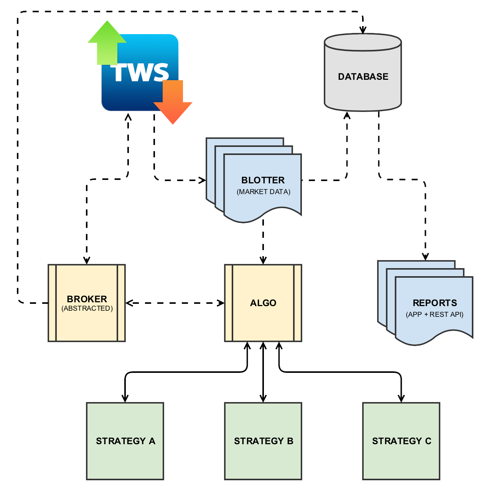

Library Structure
=================

There are 5 main components to QTPyLib:

1. ``Blotter`` - handles market data retrieval and processing.
2. ``Broker`` - sends and process orders/positions (abstracted layer).
3. ``Algo`` - (sub-class of ``Broker``) communicates with the ``Blotter`` to pass market data to your strategies, and process/positions orders via ``Broker``.
4. ``Reports`` - provides real-time monitoring of trades and open positions via Web App, as well as a simple REST API for trades, open positions, and market data.
5. Lastly, **Your Strategies**, which are sub-classes of ``Algo``, handle the trading logic/rules and does most of its operation using the ``Instument API``. This is where you'll write most of your code.

The ``Workflow`` module is a utility module that includes a few handy methods for working with external data sources when backtesting (see the `Data Workflow <./workflow.html>`_ section for more info).

Please refer to the `API Reference <api.html>`_ for a complete list of available methods.

-----

Flow Chart
----------

